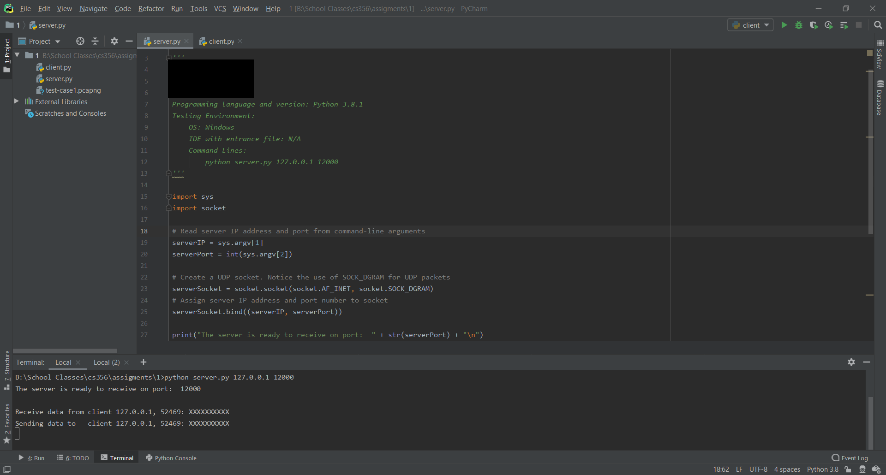
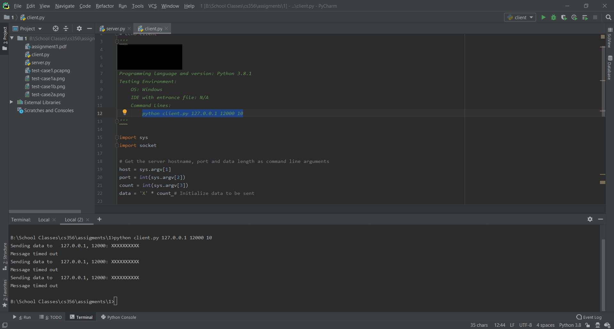
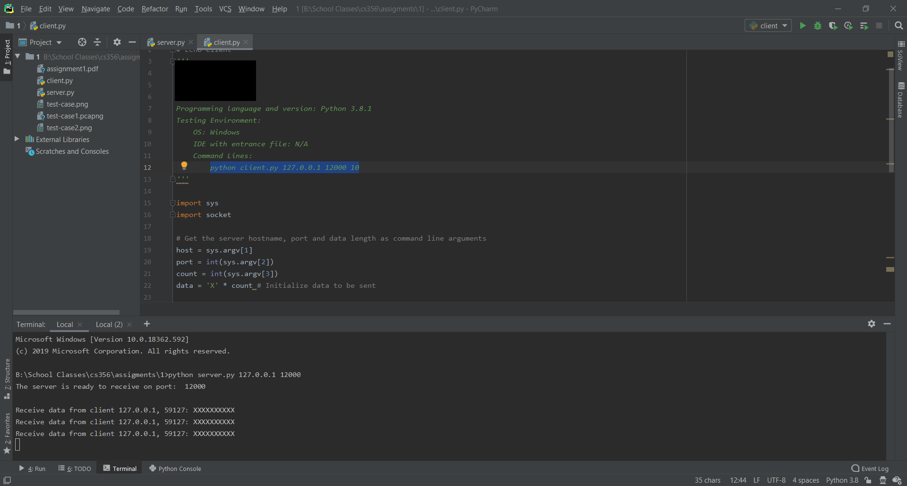

# Echo
_This project is from my networking class_

This program implements two scripts 'client.py' and 'server.py' and uses UDP sockets. 
The client program sends a string with a specific length to the server over
the network, and the server just echoes back that string to the client.

The client program takes parameters in command-line:

- IP address of server\
- UDP port of server\
- Length of string to be sent\

The client program reads the parameters, initializes a string of the specified length, 
and sends the message using the UDP socket API to the server running at the specified IP address
and port. If the client does not receive a message back from the server within a certain amount 
of time, the client retries up to three tries before terminating. The program prints out when 
data is sent and received.

## Test case when message sent and received on client's side
#### Client

 

#### Server

 

## Test case when message is sent and there is not response from the server
#### Client

 

#### Server

